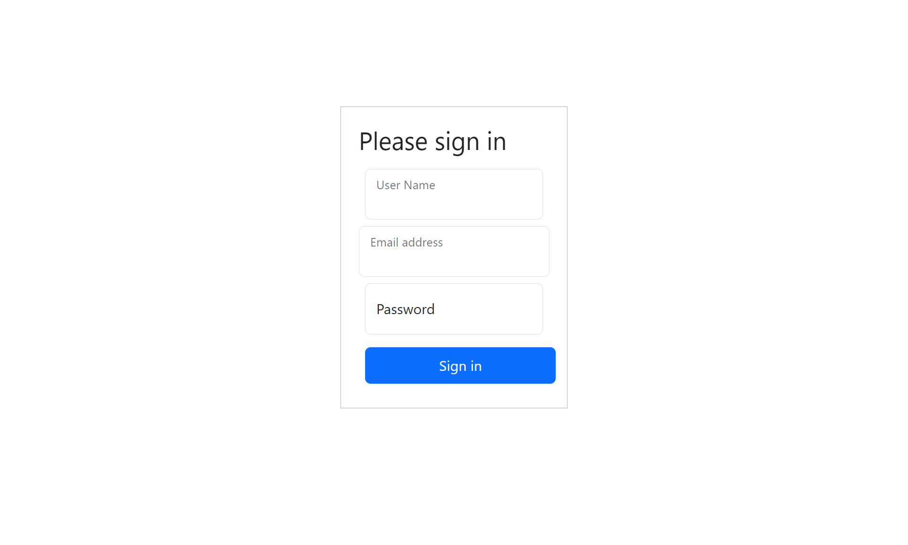
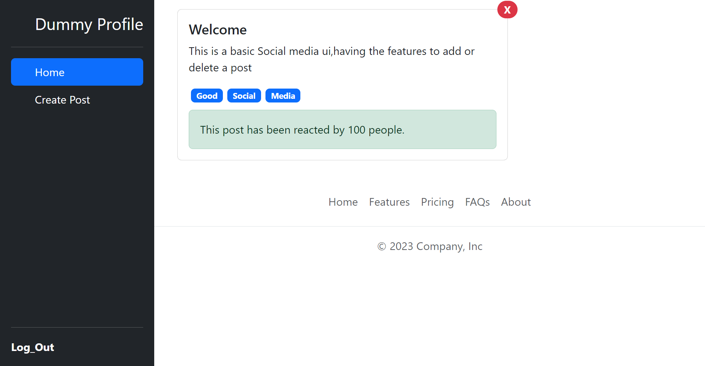
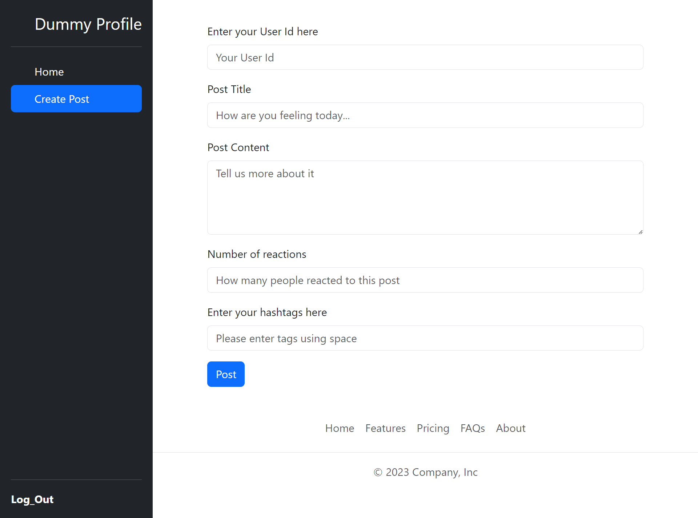

# Basic Social Media UI (Frontend)

Explore and share your thoughts with the Basic Social Media UI frontend! This web application allows users to log in, view posts, and create new posts with titles, descriptions, and hashtags.

## Features

- **User Authentication**: Log in securely to your account to access the app's features.
- **Create Posts**: Create new posts with titles, descriptions, and hashtags.
- **Delete Posts**: You can delete your posts
- **Post Details**: Click on a post to view its details, including title, description, and hashtags.
- **Responsive Design**: Enjoy a seamless experience on both desktop and mobile devices.

## Technologies Used

- React.js
- React Router
- Bootstrap
- JavaScript
- HTML
- CSS

## Screenshot

-LoginPage(name:"Dummyname";mail:"Dummymail@abc.com";password:"DummyPassword")

-Home

-CreatePost

